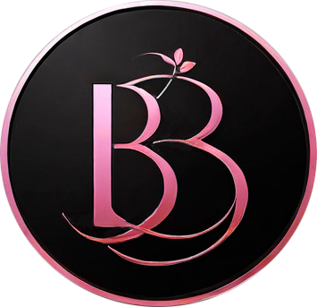
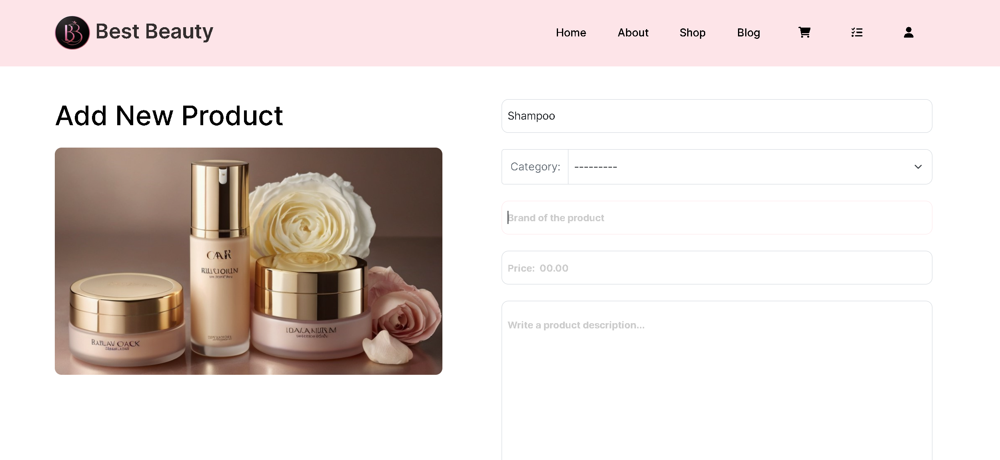
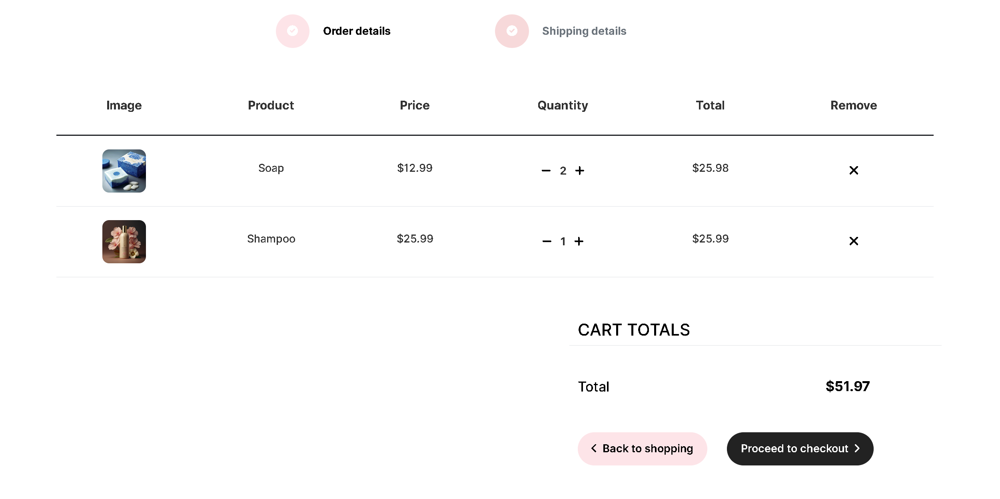
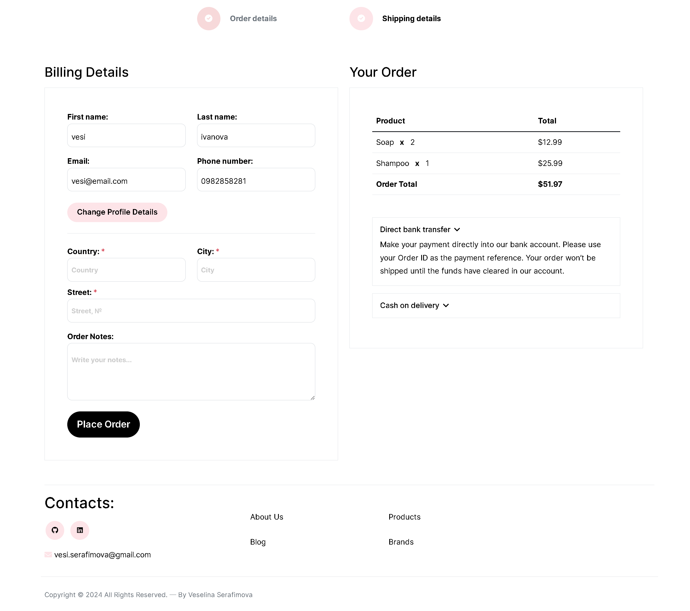
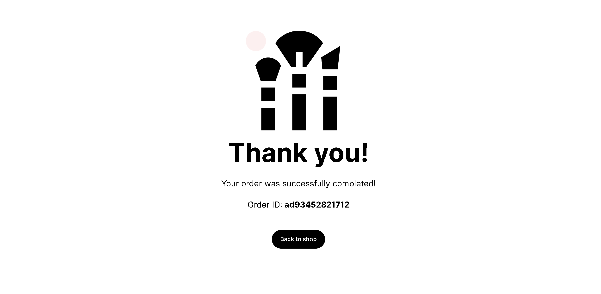

<h1> Best Beauty</h1>

    Best Beauty is cosmetics web application, designed as a platform akin to cosmetics retailers. It provides online shopping, where users can browse, search, and purchase cosmetics products including of skin care, hair care, personal care and beauty products of different brands.
    In addition, this platform includes an informative blog section, where users can access a variety of articles. 

 

<h3>Features:</h3>
<ul>
  <li>
    <strong>Summary:</strong> Not registered users are restricted. They can only watch products, brands and read articles. When user is registered receives "Welcome" email. Registered users have rights to edit or delete their own profile. They can buy products - add to cart, checkout. When user has placed order, he receives "Confirmation order" email. 
  </li>
  <li>
    <strong>User management:</strong> It has 2 groups of administration: manager and admin. Managers have rights to create, read, update and delete Articles and Products. Managers can process orders, but they are restricted to add products in cart and place orders. They cant edit or delete other users. Admins have full CRUD rights.
  </li>
<li>
    <strong>Articles:</strong> search functionality, pagination.
</li>
<li>
    <strong>Products:</strong> search functionality, filters based on categories, brands, max price, min price, add product in cart.
</li>

<li>
    <strong>Orders:</strong> cart details, change quantity of products, checkout page with shipping details form, page for order processing.
</li>
  <li>
     <strong>Technologies:</strong> Python, Django, HTML, CSS, JS, Bootstrap, Azure. 
  </li>
</ul>

<h5>Home page:</h5>

  

<h5>All products:</h5>

  

<h5>Add new product:</h5>

  

<h5>Product details:</h5>

  

<h5>Edit product:</h5>

  

<h5>All brands:</h5>

  

<h5>Create new article:</h5>

  

<h5>Edit article:</h5>

  

<h5>Cart page:</h5>

  

<h5>Checkout page:</h5>

  

<h5>'Thank you' page - after the customer has placed an order:</h5>

  

<h5>Page where the manager or admin processes the orders:</h5>

  

