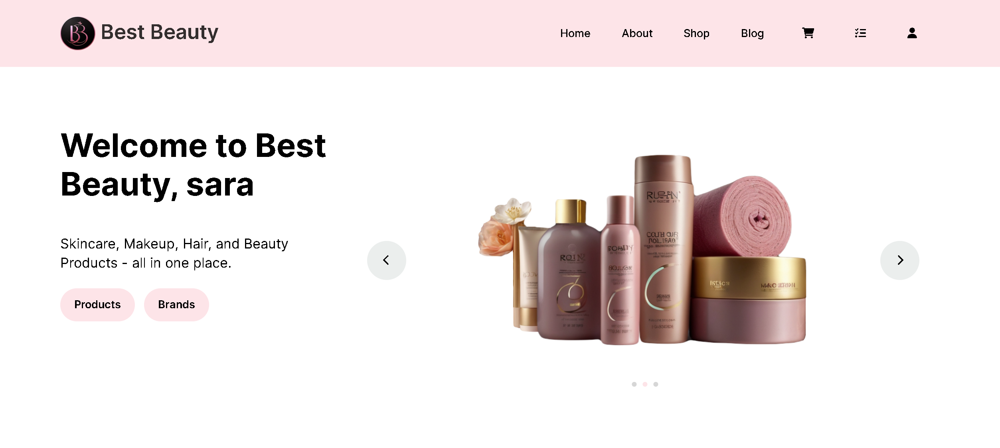

<h2> Best Beauty</h2>

<h3> Try it here: https://bestbeauty.azurewebsites.net/ </h3>

This application represents basic cosmetics store. Best Beauty is online retailer offering cosmetics products including of skin care, hair care, personal care and beauty products of different brands. 
 
<h3>Features:</h3>
<ul>
  <li>
    <strong>Summary:</strong> Not registered users are restricted. They can only watch products, brands and read articles. When user is registered receives "Welcome" email. Registered users have rights to edit or delete their own profile. They can buy products - add to cart, checkout. When user has placed order, he receives "Confirmation order" email. When order has been placed manager can processed it. 
  </li>
  <li>
    <strong>User management:</strong> It has 2 goups of administration: manager and admin. Managers have rights to create, read, edit, delete Articles and Products. Managers are restricted to add products in cart and place orders. They cant edit or delete other users. Admins have full CRUD rights.
    </li>
  <li>
     <strong>Technologies:</strong> Python, Django, HTML, CSS, JS, Azure. 
  </li>
</ul>
<h5>Home page:</h5>

  

<h5>Add new product:</h5>

  

<h5>Edit product:</h5>

  

<h5>Create new article:</h5>

  

<h5>Edit article:</h5>

  

<h5>Cart page:</h5>

  

<h5>Checkout page:</h5>

  

<h5>'Thank you' page - after the customer has placed an order:</h5>

  

<h5>Page where the manager or admin processes the orders:</h5>

  

